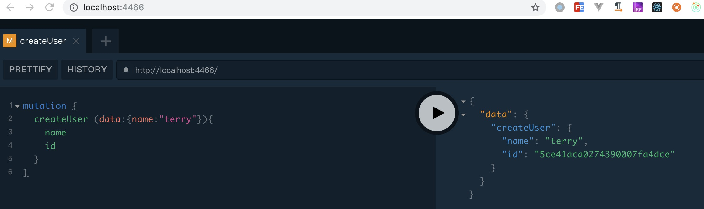
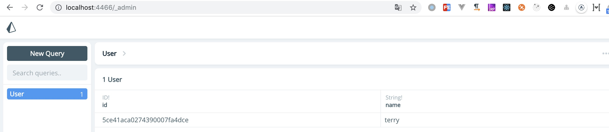

## 安装Docker(install Docker)
You must install Docker
* [Docker-for-mac](https://docs.docker.com/docker-for-mac/)
* [docker-for-windows](https://docs.docker.com/docker-for-windows/install/)
## 安装prisma(install)
```bash
npm i -g prisma
```

```bash
prisma init db  //初始化prima

```

## 选择数据库(select local MongoDB)
>  Set up a new Prisma server or deploy to an existing server? (Use arrow keys)
>  Set up a new Prisma server for local development (based on docker-compose):
* ❯ Use existing database             Connect to existing database     // 连接本地数据库
* Create new database               Set up a local database using Docker   // 新建数据库

> Or deploy to an existing Prisma server:
* Demo server + MySQL database      Free development environment hosted in Prisma Cloud   //云数据库
* Use other server                  Manually provide endpoint of a running Prisma server  //云数据库

## 选择数据库类型(select MongoDB)
> What kind of database do you want to deploy to? (Use arrow keys)
* ❯ MySQL           MySQL compliant databases like MySQL or MariaDB
* PostgreSQL        PostgreSQL database
* MongoDB           Mongo Database

*? Set up a new Prisma server or deploy to an existing server? Use existing database
*? What kind of database do you want to deploy to? MongoDB
*? Enter MongoDB connection string mongodb://localhost:27017
*? Please select the schema you want to introspect yourdbname
*? Select the programming language for the generated Prisma client Don't generate

##  输入连接MongoDb (Connection details for MongoDB)
> ? Enter MongoDB connection string
```bash
mongodb://localhost:27017
```
### 初始化完成 （Launch Prisma）
Created 3 new files:
  prisma.yml           Prisma service definition
  datamodel.prisma    GraphQL SDL-based datamodel (foundation for database)
  docker-compose.yml   Docker configuration file

> 删除 (delete schema)  in---docker-compose.yml
```bash
schema: xxxxx  //this line
```
* about issus https://github.com/prisma/prisma/issues/4334

Next steps:

  1. Open folder: cd db
  2. Start your Prisma server: docker-compose up -d
  3. Deploy your Prisma service: prisma deploy
  4. Read more about Prisma server:

prisma deploy
Creating stage default for service default ✔
Deploying service `default` to stage `default` to server `local` 1.4s

Changes:

  User (Type)
  + Created type `User`
  + Created field `id` of type `ID!`
  + Created field `name` of type `String!`

Applying changes 1.2s

Your Prisma endpoint is live:

  HTTP:  http://localhost:4466
  WS:    ws://localhost:4466

You can view & edit your data here:

  Prisma Admin: http://localhost:4466/_admin

## test
Open your browser at [http://localhost:4466](http://localhost:4466) and start sending queries.

**mutation createUser `name` argument:**

```graphql
mutation {
  createUser (data:{name:"terry"}){
    name
    id
  }
}
```
you can see

## test admin
Open your browser at [http://localhost:4466/_admin](http://localhost:4466/_admin) and start sending queries.


